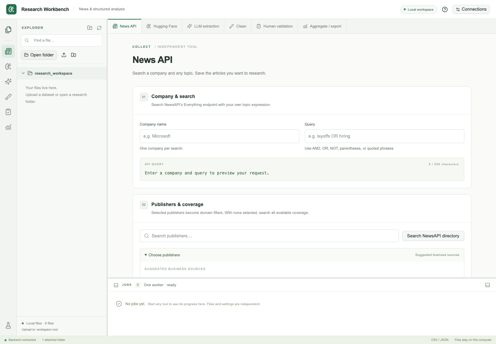

# Research Workbench

Local classroom research tools for collecting news, classifying text, designing extraction schemas, cleaning data, human validation, and aggregation. Students download an installer, open the workbench in their browser, and enter their own API keys. Python, Node.js, Git, and Docker are not required.

## Download for Mac

[**Download for Mac**](https://github.com/TheAliAhmadi/News_Workshop/releases/latest) — Apple Silicon, macOS 14 or newer  
File: `ResearchWorkbench-*-macOS-arm64.dmg`

Open the disk image and drag **Research Workbench** into Applications.

## Download for Windows

[**Download for Windows**](https://github.com/TheAliAhmadi/News_Workshop/releases/latest) — Windows 11, 64-bit  
File: `ResearchWorkbench-*-Windows-x64-Setup.exe`

Run the setup file. It installs for your user account only.

Intel Macs and native Windows on ARM are not included in this release. Classification runs on the CPU; no NVIDIA driver is required.

## Student quick start

1. Install and open **Research Workbench**. Your browser opens the workbench after a short startup check.
2. Choose a research folder (default: `~/ResearchWorkbench`).
3. Enter NewsAPI and/or OpenAI keys under **Connections**. Leave **Remember on this computer** on to store them in your system keychain or credential manager.
4. Optionally use **Prepare FinBERT for class** so the default classifier downloads once and stays cached.
5. Upload or attach data, run a tool, and watch jobs in the bottom panel. Cancelled work keeps checkpoints—resume explicitly when ready.

Illustrated steps: [Student guide](docs/student-guide.md).



## Tools

| Workspace | Independent operation |
| --- | --- |
| News API | Combine a company name and unrestricted query with AND, choose suggested or discovered publisher domains, and save raw Everything results. |
| Hugging Face / FinBERT | Choose any CSV/JSON dataset, order the text sections, select a compatible classifier, and save original columns with native labels, scores, exact input, revision, and truncation metadata. |
| LLM extraction | Describe any extraction task in Design with AI to generate and refine instructions, enums, and a nested schema, or edit them yourself. Choose a dataset and model, test one row, then process selected rows. |
| Clean | Normalize selected columns, optionally lowercase/drop empty rows, and deduplicate using selected keys. |
| Human validation | Sample any coded file, enter categorical human labels, and save agreement results. The five-row ESG exercise is a preset. |
| Aggregate / export | Map your columns into the existing firm/publication-month mention measures. |

## Connections and data locations

Keys entered in **Connections** stay on the computer. Remembered credentials use macOS Keychain or Windows Credential Manager through `keyring`. If secure storage is unavailable, keys remain session-only and the interface says so; plaintext keys are never saved silently.

Installed application files are separate from writable user data:

- Settings, roots, jobs, and checkpoints → per-user application data
- Model downloads → per-user cache
- Research files → `~/ResearchWorkbench` by default (changeable in the app)

Upgrades preserve these locations. Uninstalling does not delete research data.

NewsAPI and OpenAI require your own accounts. The app uses [NewsAPI Everything](https://newsapi.org/docs/endpoints/everything). The default classifier is [yiyanghkust/finbert-esg](https://huggingface.co/yiyanghkust/finbert-esg).

## Source setup (instructors and contributors)

For development from this repository:

```sh
# Python environment
uv venv .venv
uv pip install --python .venv/bin/python -r requirements.txt -r requirements-dev.txt

# Interface (Node.js 20.9+)
cd frontend && npm ci && npm run build && cd ..

# Launch
./'Launch Workshop.command'
```

Copy `.env.example` to `.env` for local keys during source-based use. Packaging scripts live under `packaging/`; see [publisher signing](docs/publisher-signing.md) before publishing installers.

```sh
.venv/bin/python -m pytest -q
cd frontend && npm run typecheck && npm run build
```

Browser tests: start the local app, then `npx playwright install chromium && npm run test:e2e` in `frontend/`. See [verification](docs/verification.md), [instructor guide](docs/instructor-guide.md), and [architecture](docs/architecture.md).

## Releases

GitHub Actions builds Mac and Windows packages and opens a **draft** release with installers, checksums, and third-party notices. Public student downloads wait until installers are [signed and verified](docs/publisher-signing.md). The release plan is in `PLAN_release.md`.
